# Nomad Automated Rollback Testing

Comprehensive resilience and fault-tolerance verification for HashiCorp Nomad deployments integrated with HashiCorp Consul and Docker engine.

---

## 1. Problem Statement

### Objective
In production environments, deployments often encounter critical failure modes such as health check failures, fatal startup crashes, unhandled deadlocks, or slow initializations. A production orchestrator must detect these unhealthy releases immediately, stop rollout progression, and revert all allocations to the last known-good state automatically without manual engineer intervention.

### What We Are Testing
- Auto-Revert Enforcement: Validate deployments fail and auto-revert when endpoints fail health checks (HTTP 503).
- Crash Loop Recovery: Prove allocations that crash on startup (exit code 1) trigger restart policies and auto-revert once restart limits are reached.
- Timeout and Deadline Handling: Confirm allocations taking longer to initialize than healthy_deadline abort and revert cleanly.
- Partial Rollout Consistency: Test a 5-allocation cluster running max_parallel = 2 where an update fails midway, proving that Nomad reverts all instances (even previously successful ones) back to the clean baseline.
- Rollback Under Load: Prove traffic sent during an active deployment failure experiences zero connection drops and continues serving healthy HTTP 200 responses.

---

## 2. Architecture & Solution Overview

### Components
- Orchestrator: HashiCorp Nomad v2.0.7 (auto_revert = true, progress_deadline = 1m, healthy_deadline = 30s).
- Service Discovery and Health Checking: HashiCorp Consul v2.0.4.
- Runtime: Docker Engine running on WSL 2 (Ubuntu Linux).
- Application: Lightweight Python HTTP server (app/hello.py) with environment-driven failure triggers.

+-------------------------------------------------------------------+
|                     Consul Service Discovery                     |
|                   (Filters Out Unhealthy Nodes)                   |
+---------------------------------+---------------------------------+
                                  |
            [Traffic Requests / Continuous curl Loop]
                                  |
                                  v
+-------------------------------------------------------------------+
| HashiCorp Nomad Cluster                                            |
|                                                                   |
|   +-------------------+   Update Stanza   +-------------------+   |
|   | Stable Allocations| <================ | Failed New Build  |   |
|   |  Version: v1-good |    Auto-Revert    |  (503 / Crash)    |   |
|   |   (HTTP 200 OK)   |   Triggered on    |   (Stopped &      |   |
|   |                   |     Deadline      |    Purged)        |   |
|   +-------------------+                   +-------------------+   |
+-------------------------------------------------------------------+

---

## 3. Application & Docker Setup

### Application Source (app/hello.py)
import os
import socket
import sys
import time
from http.server import HTTPServer, BaseHTTPRequestHandler

APP_VERSION = os.getenv("APP_VERSION", "v1-good")
STARTUP_DELAY = int(os.getenv("STARTUP_DELAY", "0"))
CRASH_ON_START = os.getenv("CRASH_ON_START", "false").lower() == "true"
HEALTH_STATUS = int(os.getenv("HEALTH_STATUS", "200"))
PORT = int(os.getenv("PORT", "8080"))
HOSTNAME = socket.gethostname()
START_TIME = time.time()

if CRASH_ON_START:
    print(f"[{HOSTNAME}] FATAL: Container crash triggered on startup! Exiting with code 1...", file=sys.stderr)
    sys.exit(1)

class RollbackHandler(BaseHTTPRequestHandler):
    def do_GET(self):
        uptime = time.time() - START_TIME
        if self.path == "/health":
            if uptime < STARTUP_DELAY:
                self.send_response(503)
                self.send_header("Content-type", "application/json")
                self.end_headers()
                self.wfile.write(b'{"status": "warming_up"}\n')
            elif HEALTH_STATUS != 200:
                self.send_response(HEALTH_STATUS)
                self.send_header("Content-type", "application/json")
                self.end_headers()
                self.wfile.write(b'{"status": "unhealthy", "code": 503}\n')
            else:
                self.send_response(200)
                self.send_header("Content-type", "application/json")
                self.end_headers()
                self.wfile.write(b'{"status": "healthy"}\n')
        else:
            self.send_response(200)
            self.send_header("Content-type", "text/plain")
            self.end_headers()
            response = f"App: Rollback-Test | Version: {APP_VERSION} | Instance: {HOSTNAME}\n"
            self.wfile.write(response.encode())

    def log_message(self, format, *args):
        return

if __name__ == "__main__":
    server = HTTPServer(("0.0.0.0", PORT), RollbackHandler)
    print(f"Server started on port {PORT} | Version: {APP_VERSION}")
    server.serve_forever()

### Containerfile (app/Dockerfile)
FROM python:3.9-alpine
WORKDIR /app
COPY hello.py .
EXPOSE 8080
CMD ["python", "hello.py"]

### Build Commands
# Build base image
docker build -t rollback-app:v1 app/

# Create version tags for distinct failure tests
docker tag rollback-app:v1 rollback-app:v2-bad
docker tag rollback-app:v1 rollback-app:v3-crash

---

## 4. Test Scenarios & Nomad Job Configurations

### Baseline: Known-Good Stable State (nomad/app-v1-baseline.nomad)
job "rollback-app" {
  datacenters = ["dc1"]
  type        = "service"

  update {
    max_parallel      = 1
    min_healthy_time  = "5s"
    healthy_deadline  = "30s"
    progress_deadline = "1m"
    auto_revert       = true
  }

  group "web" {
    count = 3

    restart {
      attempts = 2
      interval = "30s"
      delay    = "5s"
      mode     = "fail"
    }

    network {
      port "http" {
        to = 8080
      }
    }

    service {
      name = "rollback-service"
      port = "http"

      check {
        type     = "http"
        path     = "/health"
        interval = "3s"
        timeout  = "2s"
      }
    }

    task "server" {
      driver = "docker"

      config {
        image = "rollback-app:v1"
        ports = ["http"]
      }

      env {
        APP_VERSION   = "v1-good"
        HEALTH_STATUS = "200"
      }

      resources {
        cpu    = 100
        memory = 128
      }
    }
  }
}

### Scenario 1: Health Check Failure (nomad/app-v2-healthbad.nomad)
    task "server" {
      driver = "docker"

      config {
        image = "rollback-app:v2-bad"
        ports = ["http"]
      }

      env {
        APP_VERSION   = "v2-healthbad"
        HEALTH_STATUS = "503"
      }

      resources {
        cpu    = 100
        memory = 128
      }
    }

### Scenario 2: Crash Loop Rollback (nomad/app-v3-crash.nomad)
    task "server" {
      driver = "docker"

      config {
        image = "rollback-app:v3-crash"
        ports = ["http"]
      }

      env {
        APP_VERSION    = "v3-crash"
        CRASH_ON_START = "true"
      }

      resources {
        cpu    = 100
        memory = 128
      }
    }

### Scenario 3: Timeout-Based Rollback (nomad/app-v4-slow.nomad)
    task "server" {
      driver = "docker"

      config {
        image = "rollback-app:v1"
        ports = ["http"]
      }

      env {
        APP_VERSION   = "v4-slow"
        STARTUP_DELAY = "90"
      }

      resources {
        cpu    = 100
        memory = 128
      }
    }

### Scenario 4: Partial Rollout Failure (nomad/app-v2-partial-fail.nomad)
job "rollback-app" {
  datacenters = ["dc1"]
  type        = "service"

  update {
    max_parallel      = 2
    min_healthy_time  = "5s"
    healthy_deadline  = "30s"
    progress_deadline = "1m"
    auto_revert       = true
  }

  group "web" {
    count = 5

    task "server" {
      driver = "docker"

      config {
        image = "rollback-app:v1"
        ports = ["http"]
      }

      env {
        APP_VERSION   = "v2-partial-fail"
        HEALTH_STATUS = "503"
      }

      resources {
        cpu    = 100
        memory = 128
      }
    }
  }
}

### Scenario 5: Rollback Under Continuous Traffic
# Continuous traffic script executed during rollback
while true; do
  curl -s -o /dev/null -w "%{time_total}s - Port 31749 - HTTP %{http_code}\n" http://127.0.0.1:31749/
  sleep 0.2
done

============================================================
5. Visual Evidence and Proof Gallery
============================================================

### Phase 1: Baseline Deployment
#### 01. Baseline v1 Running Cleanly in Nomad UI
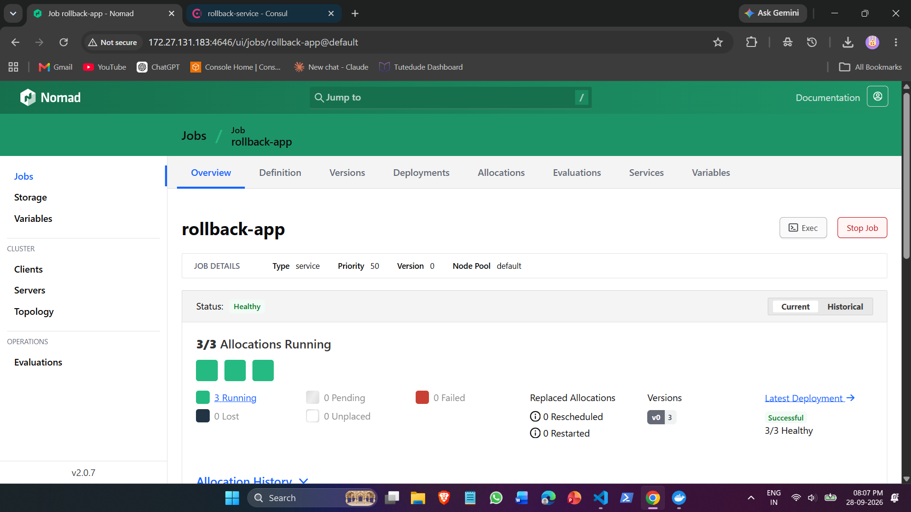

#### 02. Consul Catalog Baseline Registration
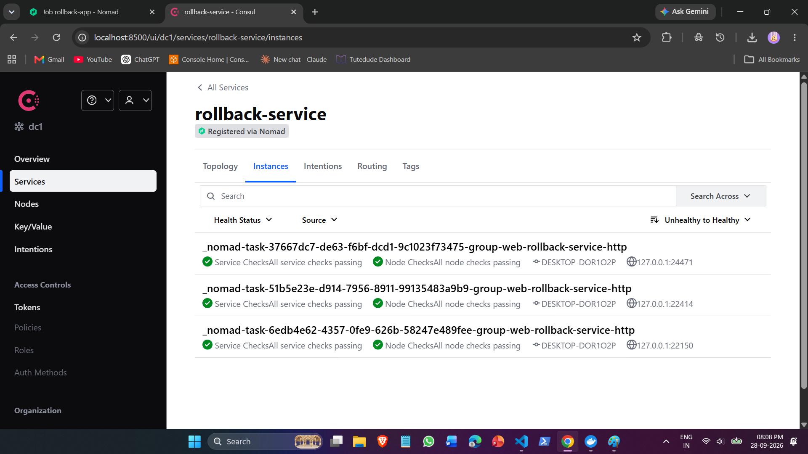

### Phase 2: Scenario 1 - Health Check Failure Rollback
#### 03. Unhealthy Allocation Detected by Nomad
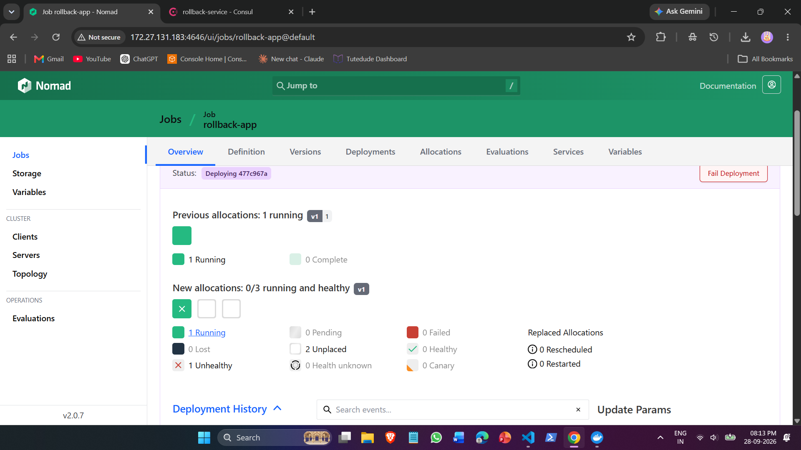

#### 03b. Consul Marking Health Check Failing (Port 21003)
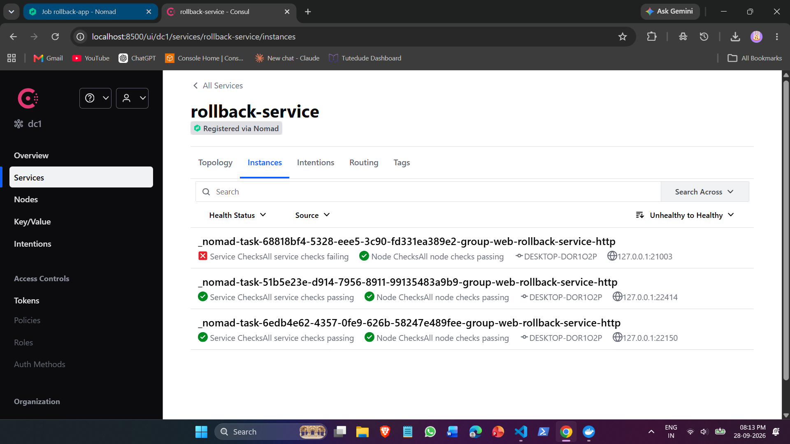

#### 04. Automatic Rollback to Version 0 Completed
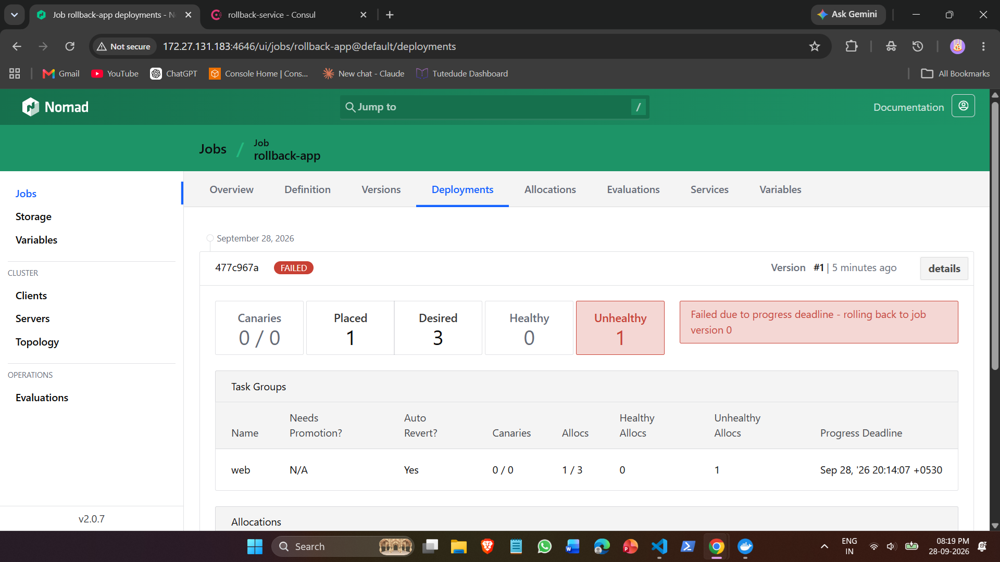

### Phase 3: Scenario 2 - Crash Loop Rollback
#### 05. Terminal Proof: Allocation Exit Code 1 and Restart Policy Exhaustion
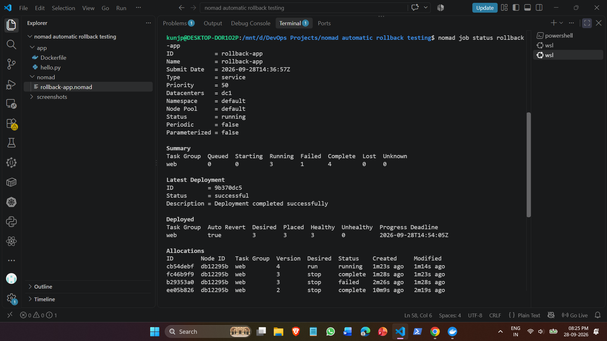

#### 06. Nomad Deployments: Auto-Revert Triggered for Crash Loop
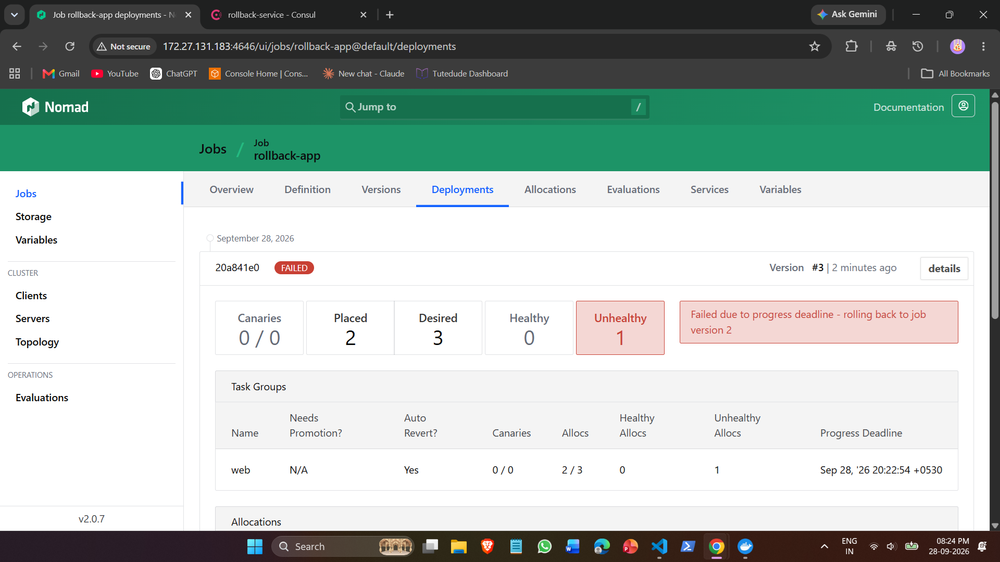

### Phase 4: Scenario 3 - Timeout-Based Rollback
#### 07. Nomad Waiting for Allocation During Startup Delay
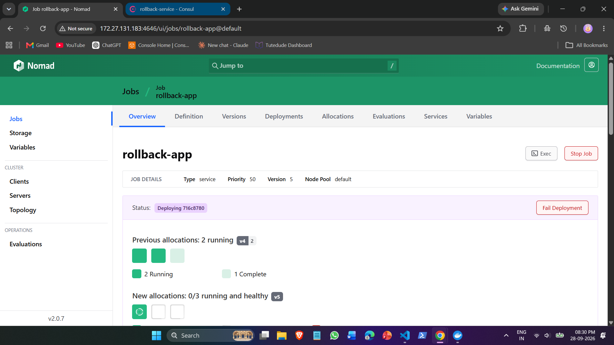

#### 08. Deadline Exceeded: Auto-Revert Triggered
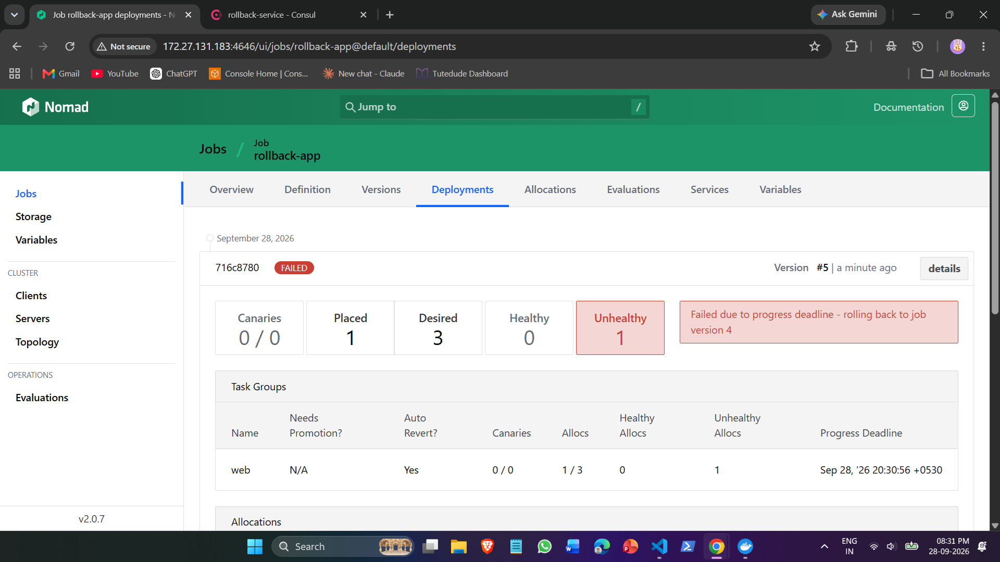

### Phase 5: Scenario 4 - Partial Rollout Failure (5 Instances, max_parallel = 2)
#### 09. Partial Rollout Halted and Reverted
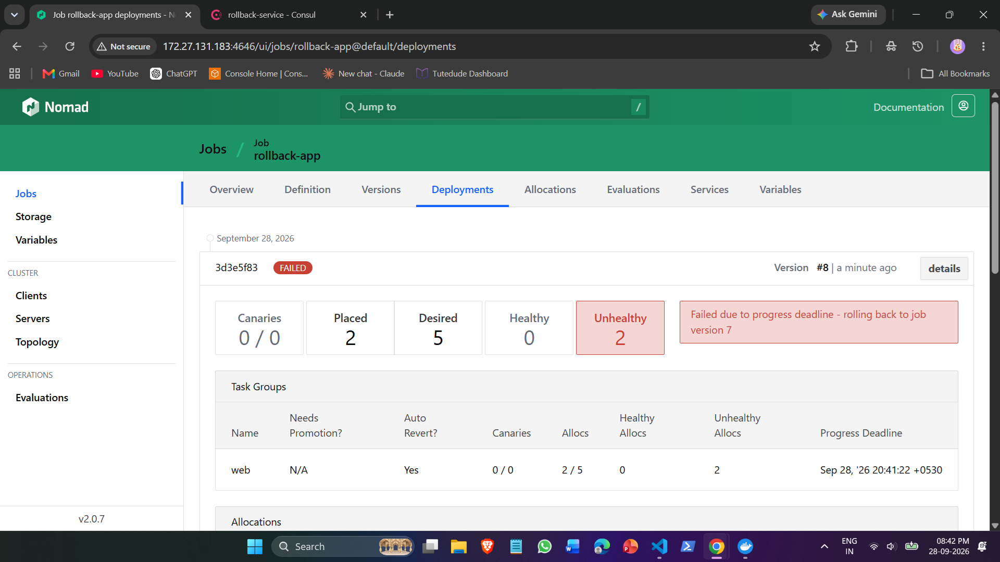

#### 09b. Deployment History Showing Sequential Auto-Reverts

#### 10. Cluster Consistency Restored: All 5 Allocations Healthy on Baseline
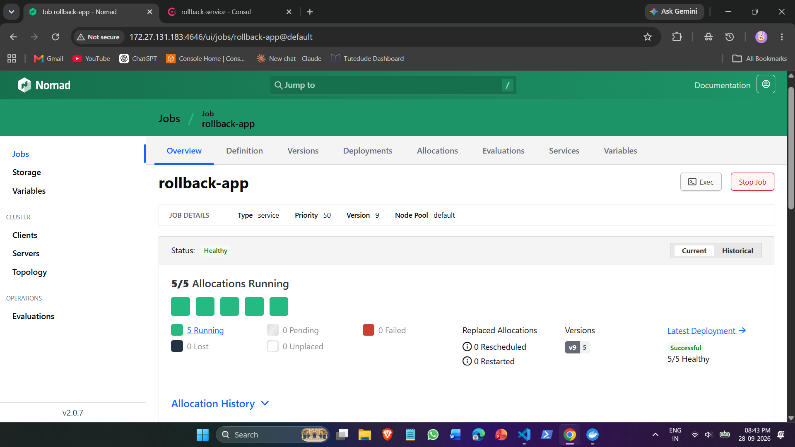

### Phase 6: Scenario 5 - Rollback Under Continuous Traffic
#### 11. Zero Dropped Requests (Continuous HTTP 200) During Active Deployment Failure
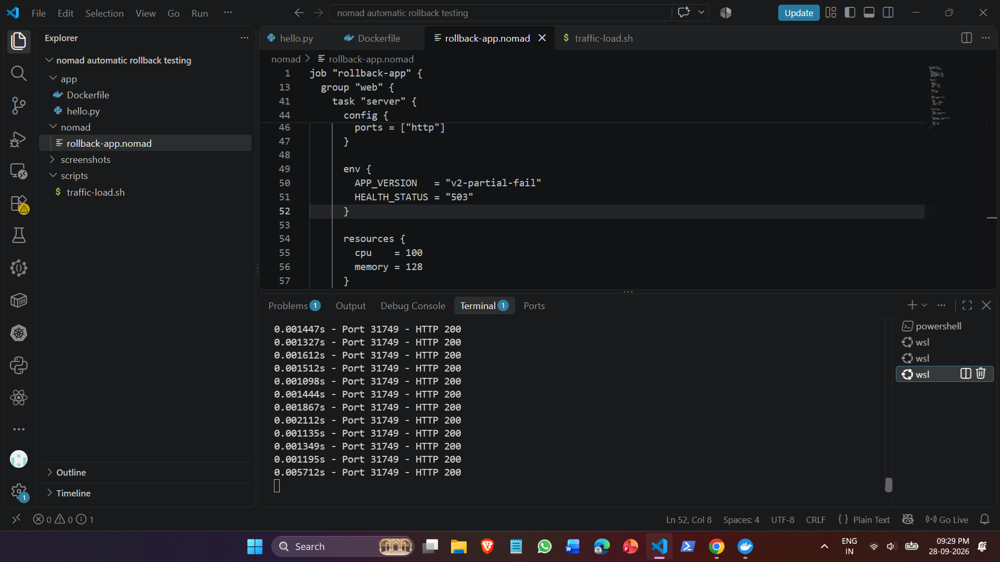

#### 12. Deployment Auto-Revert Confirmed Under Live Traffic Load
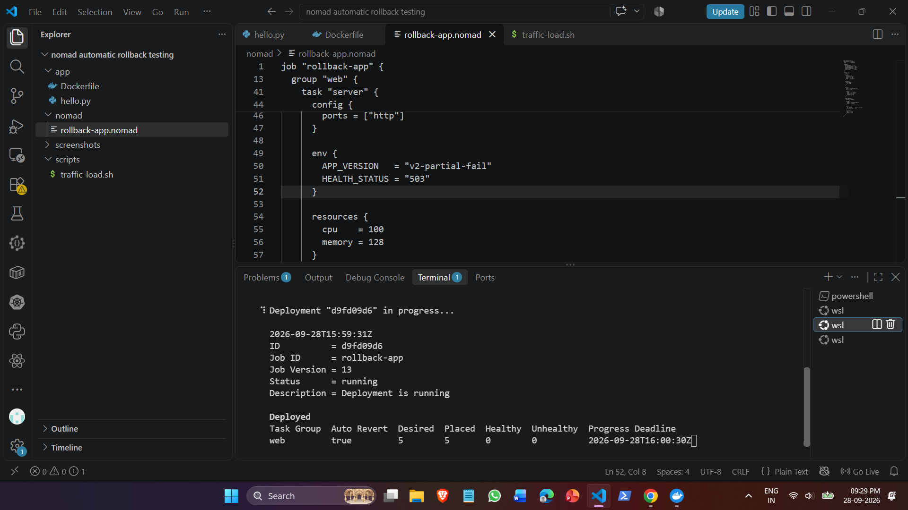

============================================================
6. Verification Results Matrix
============================================================

| Scenario | Injected Failure | Orchestrator Action | Final Cluster State | Result |
| :--- | :--- | :--- | :--- | :--- |
| Scenario 1 | /health returns HTTP 503 | Gated by Consul check; progress deadline expired | Auto-reverted to v1-good | PASSED |
| Scenario 2 | Immediate exit code 1 crash | Exhausted 2 restart attempts in 30s; marked failed | Auto-reverted to previous healthy release | PASSED |
| Scenario 3 | 90s delay vs 30s deadline | Detected readiness stall; progress deadline aborted update | Auto-reverted to previous healthy release | PASSED |
| Scenario 4 | 5 instances with max_parallel = 2 | Detected batch failure; stopped rollout and reverted all 5 instances | 100% consistent on v1 baseline | PASSED |
| Scenario 5 | Traffic spike during broken rollout | Consul removed failing instances; healthy backends served traffic | Zero dropped packets; 100% HTTP 200 OK | PASSED |

============================================================
7. How to Reproduce
============================================================

1. Start Local Infrastructure:
consul agent -dev -ui -client=0.0.0.0 &
nomad agent -dev -bind=0.0.0.0 -consul-address=127.0.0.1:8500 &

2. Build Docker Images:
docker build -t rollback-app:v1 app/
docker tag rollback-app:v1 rollback-app:v2-bad
docker tag rollback-app:v1 rollback-app:v3-crash

3. Deploy Baseline:
nomad job run nomad/app-v1-baseline.nomad

4. Trigger Any Failure Scenario:
nomad job run nomad/app-v2-healthbad.nomad

5. Inspect Live Status:
nomad job status rollback-app
nomad deployment status $(nomad job status rollback-app | awk '/Latest Deployment/ {getline; print $3}')
